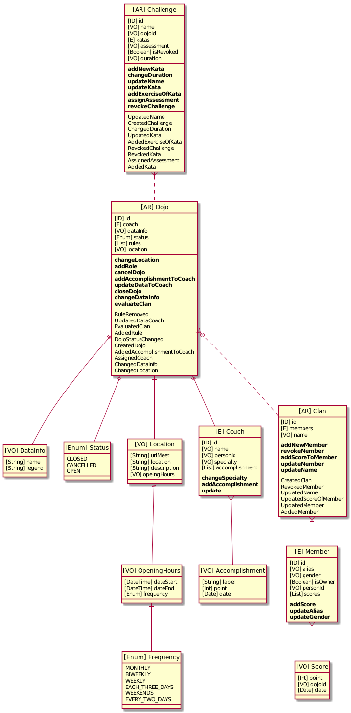

[](https://www.codacy.com?utm_source=github.com&amp;utm_medium=referral&amp;utm_content=sideralis-co/api-core&amp;utm_campaign=Badge_Coverage)
[](https://www.codacy.com?utm_source=github.com&amp;utm_medium=referral&amp;utm_content=sideralis-co/api-core&amp;utm_campaign=Badge_Grade)
## Sideralis Core
Core suddomain for handling clans, dojos and challenges.

Core of business for sideralis.

#### Motivation
A domain-oriented designer, clean architecture, and clear business domain specs are used.

The CQRS pattern will be used with Event Sourcing + EDA. It is segregated into two Queries and Commands applications. Commands are executed with a single instruction or entrypoint. Los Queries also has two unique entrypoints (one for lists and one for the unique model). The databases are managed as collections.


### Domain model



### Install Local
The application depends on three fundamental elements. Must be running mongodb, nats and gitlab. Those items that can be used with Docker.
```sh
docker run -d --name nats -p 4222:4222 nats 

docker run -d --name mongodb  -p 27017:27017 -v $HOME/data:/data/db mongo:3

export GITLAB_HOME=/srv
docker run --detach \
  --hostname gitlab.example.com \
  --publish 443:443 --publish 80:80 --publish 22:22 \
  --name gitlab \
  --volume $GITLAB_HOME/gitlab/config:/etc/gitlab \
  --volume $GITLAB_HOME/gitlab/logs:/var/log/gitlab \
  --volume $GITLAB_HOME/gitlab/data:/var/opt/gitlab \
  gitlab/gitlab-ce:latest
```
### Install Remoto
To install and run on a cloud platform.

```sh
kubectl create namespace gitlab
kubectl create secret generic -n gitlab smtp-password --from-literal=password=@dm1n2020

##install gitlab
helm upgrade --install gitlab gitlab/gitlab \
  -f gitlab-config.yaml\
  --namespace=gitlab\
  --timeout 600s \
  --set global.hosts.domain=sideralis.co \
  --set global.hosts.externalIP=35.239.30.252 \
  --set certmanager-issuer.email=admin@sideralis.co

## get password of gitlab for root user 
kubectl get secret gitlab-gitlab-initial-root-password --namespace gitlab -ojsonpath='{.data.password}' | base64 --decode ; echo 

## instal nats
helm upgrade --install nats bitnami/nats

## install mongodb
helm upgrade --install mongodb bitnami/mongodb 
```
## Connect to data base 
```sh
kubectl run --namespace default mongodb-client --rm --tty -i --restart='Never' --image docker.io/bitnami/mongodb:4.2.6-debian-10-r23 --command -- mongo admin --host mongodb --authenticationDatabase admin -u root -p $MONGODB_ROOT_PASSWORD
```

## Install/Update components remote
```sh
helm upgrade --install core-sideralis chart/
helm upgrade --recreate-pods core-sideralis chart/
```
